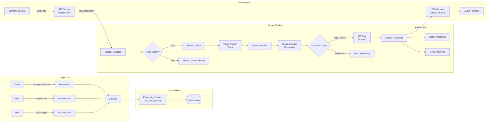

# RAG Teaching Assistant

A production-grade **Retrieval-Augmented Generation (RAG)** microservice that functions as an AI Teaching Assistant. Ingest lecture videos, PDFs, and PowerPoint slides, then ask questions and receive grounded, cited answers powered by **GPT-4o**.

Now with a **Voice Agent** — speak your question and hear the answer read back to you, fully integrated with the same RAG pipeline.

---

## Architecture



---

## Tech Stack

| Component | Technology |
|---|---|
| Backend | FastAPI + Uvicorn (async) |
| LLM | OpenAI GPT-4o |
| Embeddings | sentence-transformers (all-MiniLM-L6-v2) |
| Re-ranking | cross-encoder/ms-marco-MiniLM-L-6-v2 |
| Vector Store | FAISS (with abstract interface) |
| Cache | Redis |
| Speech-to-Text | OpenAI Whisper API |
| Text-to-Speech | OpenAI TTS (`tts-1-hd`) |
| Evaluation | RAGAS |
| Containerization | Docker + docker-compose |

---

## Quick Start

### 1. Clone & Configure

```bash
cp .env.example .env
# Edit .env and set your OPENAI_API_KEY
```

### 2. Run with Docker

```bash
docker compose up --build
```

The API will be available at `http://localhost:8000`.

### 3. Run Locally (without Docker)

```bash
python -m venv venv
source venv/bin/activate
pip install -r requirements.txt

# Start Redis separately
docker run -d -p 6379:6379 redis:7-alpine

# Run the app
uvicorn app.main:app --host 0.0.0.0 --port 8000 --reload
```

---

## API Usage

### Health Check

```bash
curl http://localhost:8000/health
```

### Ingest a Document

```bash
# PDF
curl -X POST http://localhost:8000/ingest \
  -H "Content-Type: application/json" \
  -d '{
    "file_path": "/path/to/lecture.pdf",
    "source_type": "pdf",
    "source_name": "Machine Learning Lecture 1"
  }'

# PowerPoint
curl -X POST http://localhost:8000/ingest \
  -H "Content-Type: application/json" \
  -d '{
    "file_path": "/path/to/slides.pptx",
    "source_type": "ppt"
  }'

# Video
curl -X POST http://localhost:8000/ingest \
  -H "Content-Type: application/json" \
  -d '{
    "file_path": "/path/to/lecture.mp4",
    "source_type": "video"
  }'
```

### Ask a Question

```bash
curl -X POST http://localhost:8000/ask \
  -H "Content-Type: application/json" \
  -d '{
    "question": "What is gradient descent?",
    "session_id": "student-001"
  }'
```

### Ask with Streaming (SSE)

```bash
curl -N -X POST http://localhost:8000/ask \
  -H "Content-Type: application/json" \
  -d '{
    "question": "Explain backpropagation",
    "session_id": "student-001",
    "stream": true
  }'
```

### Voice — Ask by Speaking

Upload an audio recording (WAV/MP3/WebM) and receive an audio answer back:

```bash
curl -X POST http://localhost:8000/voice \
  -F "audio=@question.wav" \
  -F "session_id=student-001" \
  --output answer.mp3
```

The endpoint:
1. Transcribes your audio with **Whisper**
2. Runs the transcribed text through the full RAG pipeline
3. Converts the answer to speech with **OpenAI TTS** (`tts-1-hd`)
4. Returns an MP3 audio file

> **Tip:** In the Streamlit UI, click the microphone button to record and play back answers directly in the browser — no `curl` needed.

### Swagger Docs

Visit `http://localhost:8000/docs` for interactive API documentation.

---

## Project Structure

```
rag-assistant/
├── app/
│   ├── main.py                    # FastAPI app factory + lifespan
│   ├── api/routes.py              # API endpoints
│   ├── core/
│   │   ├── config.py              # Pydantic BaseSettings
│   │   └── logging.py             # Structured JSON logging
│   ├── models/schemas.py          # Pydantic request/response models
│   ├── services/
│   │   ├── rag_service.py         # RAG orchestrator
│   │   ├── retrieval_service.py   # Hybrid retrieval pipeline
│   │   ├── embedding_service.py   # Sentence-transformers encoder
│   │   ├── llm_service.py         # GPT-4o service (sync + streaming)
│   │   ├── memory_service.py      # Session conversation memory
│   │   ├── stt_service.py         # Speech-to-Text (Whisper API)
│   │   └── tts_service.py         # Text-to-Speech (OpenAI tts-1-hd)
│   └── db/
│       ├── vector_store.py        # FAISS + abstract vector store
│       └── cache.py               # Redis cache
├── ingestion/
│   ├── transcribe.py              # Video → MP3 → Whisper
│   ├── extract_pdf.py             # PDF text extraction
│   ├── extract_ppt.py             # PPT text extraction
│   └── chunk.py                   # Metadata-aware chunking
├── evaluation/
│   └── evaluator.py               # RAGAS metrics
├── docker/
│   └── Dockerfile
├── docker-compose.yml
├── requirements.txt
├── .env.example
└── README.md
```

---

## Evaluation

Run RAGAS evaluation programmatically:

```python
from evaluation.evaluator import RAGEvaluator
from app.models.schemas import EvalSample

evaluator = RAGEvaluator()

samples = [
    EvalSample(
        question="What is gradient descent?",
        answer="Gradient descent is an optimization algorithm...",
        contexts=["Gradient descent is used to minimize..."],
        ground_truth="Gradient descent is an iterative optimization algorithm."
    )
]

result = evaluator.evaluate(samples)
print(f"Faithfulness: {result.faithfulness}")
print(f"Answer Relevancy: {result.answer_relevancy}")
print(f"Context Precision: {result.context_precision}")
```

Results are logged to `logs/eval_metrics.json`.

---

## Configuration

All configuration is driven by environment variables. See `.env.example` for the full list:

| Variable | Default | Description |
|---|---|---|
| `OPENAI_API_KEY` | — | OpenAI API key (required) |
| `OPENAI_MODEL` | `gpt-4o` | Chat model |
| `OPENAI_TEMPERATURE` | `0.2` | Sampling temperature |
| `EMBEDDING_MODEL` | `all-MiniLM-L6-v2` | Sentence-transformers model |
| `CROSS_ENCODER_MODEL` | `cross-encoder/ms-marco-MiniLM-L-6-v2` | Re-ranking model |
| `TOP_K` | `10` | Vector search candidates |
| `TOP_N_RERANK` | `5` | Results after re-ranking |
| `SIMILARITY_THRESHOLD` | `0.3` | Min cosine similarity |
| `REDIS_URL` | `redis://redis:6379/0` | Redis connection URL |
| `CACHE_TTL_SECONDS` | `3600` | Cache time-to-live |
| `RATE_LIMIT` | `20/minute` | API rate limit |
| `WHISPER_MODEL` | `whisper-1` | OpenAI Whisper model for STT |
| `TTS_MODEL` | `tts-1-hd` | OpenAI TTS model |
| `TTS_VOICE` | `alloy` | TTS voice (`alloy`, `echo`, `fable`, `onyx`, `nova`, `shimmer`) |

---

## Features

- ✅ Hybrid retrieval (bi-encoder + cross-encoder re-ranking)
- ✅ Guardrails — refuses to hallucinate
- ✅ Streaming SSE responses
- ✅ Redis caching with configurable TTL
- ✅ Session-based conversation memory
- ✅ Rate limiting
- ✅ Health check endpoint
- ✅ Structured JSON logging with request-ID correlation
- ✅ Vector DB abstraction (swap FAISS for Pinecone/Qdrant)
- ✅ RAGAS evaluation metrics
- ✅ Dockerized and deployment-ready
- ✅ Swagger + ReDoc documentation
- ✅ **Voice Agent** — speak questions, hear answers (Whisper STT + OpenAI TTS)
- ✅ `/voice` endpoint accepts audio files (WAV/MP3/WebM), returns MP3
- ✅ Configurable TTS voice and model
